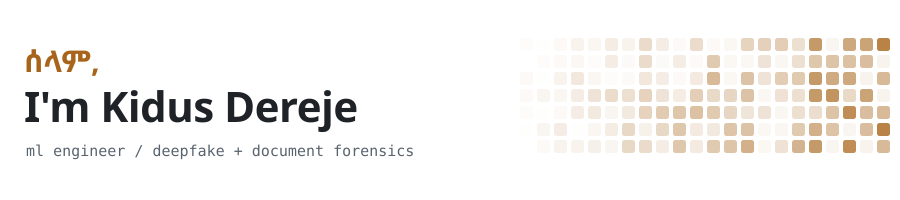
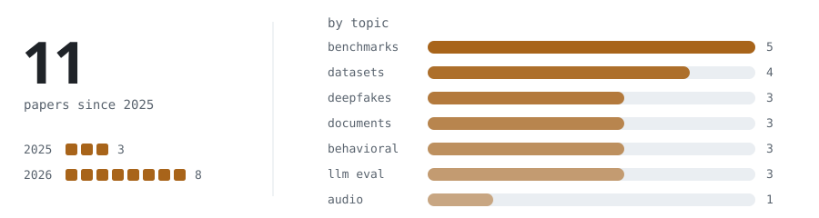
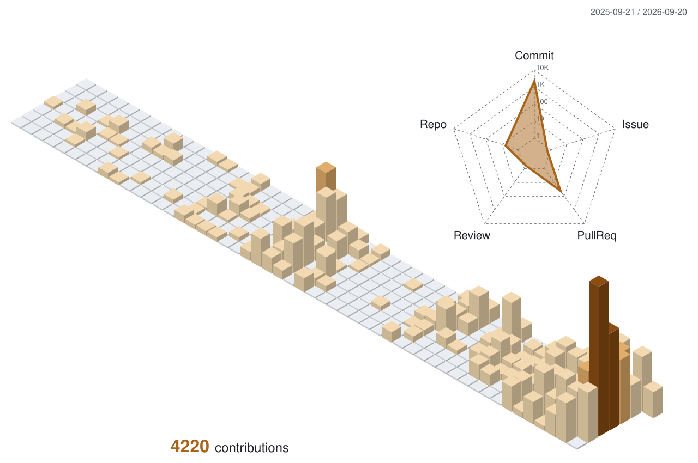

<picture>
  <source media="(prefers-color-scheme: dark)" srcset="./assets/header-dark.svg">
  
</picture>

  
  
  
  

ሰላም (sälam) means peace in Amharic. It's how people say hello in Ethiopia and Eritrea, so, hi.

I'm a founding engineer at [Scam AI](https://www.scam.ai/en), where I build systems that figure out whether an image, video, document, or voice is real. I studied Computing Science and Economics at the University of Alberta. Most of my time goes to two things: writing papers about how well detectors actually hold up once they leave the lab, and then making the ones we ship hold up better.

When I'm not doing that I'm probably shooting film or making coffee.

### what I'm working on

- **Eva**, Scam AI's detection engine. I built a lot of the core pipelines: face swaps, lip sync, GAN and diffusion fingerprints, document forgery, voice clones. It catches 98.2% of deepfakes in under 4 seconds.
- **Halo**, which we shipped with Qualcomm. It checks live Zoom, Teams and Meet calls for deepfakes about 4 times a second, fully on device, so your video never gets uploaded anywhere.
- Poking at every new image model the week it drops to see how badly it breaks document forensics. Usually pretty badly.

### research

<picture>
  <source media="(prefers-color-scheme: dark)" srcset="./assets/research-dark.svg">
  
</picture>

A few I like:

- [Anatomy of a Scam Call](https://arxiv.org/abs/2608.24127): we let an AI voice agent pick up 10,000+ real scam calls and studied how the scammers work. You can tell a call is going to escalate from the first few lines.
- [When the Forger Is the Judge](https://arxiv.org/abs/2604.25213): GPT-Image-2 can fake a receipt field so cleanly that forensic tools drop to near coin flip, and it can't spot its own edits either.
- [How well do open source AI image detectors work out of the box?](https://arxiv.org/abs/2602.07814): 23 detectors, 12 datasets, 2.6M images. Short answer: it depends a lot on what they were trained on.
- [Do Deepfake Detectors Work in Reality?](https://dl.acm.org/doi/10.1145/3709022.3736545): my first one (ACM). Turns out a bit of super resolution goes a long way toward fooling them.

The full list is on [my site](https://www.kidusder.com/about#publications) and [Scholar](https://scholar.google.com/citations?hl=en&user=t-5ck6wAAAAJ).

### stuff I build with

<picture>
  <source media="(prefers-color-scheme: dark)" srcset="https://skillicons.dev/icons?i=py%2Cpytorch%2Ctensorflow%2Csklearn%2Cfastapi%2Cdjango%2Cflask%2Cts%2Cjs%2Creact%2Cnextjs%2Ctailwind%2Caws%2Cdocker%2Ckubernetes%2Cpostgres%2Cmongodb%2Cc%2Cjava%2Cr%2Cgit%2Clinux&perline=11&theme=dark">
  
</picture>

### on github

<picture>
  <source media="(prefers-color-scheme: dark)" srcset="./profile/contrib-3d-dark.svg">
  
</picture>

  <picture>
    <source media="(prefers-color-scheme: dark)" srcset="./profile/stats-dark.svg">
    
  </picture>
  <picture>
    <source media="(prefers-color-scheme: dark)" srcset="./profile/langs-dark.svg">
    
  </picture>

<picture>
  <source media="(prefers-color-scheme: dark)" srcset="https://streak-stats.demolab.com?user=kidus-der&disable_animations=true&hide_border=true&background=00000000&ring=E8B06A&fire=E8B06A&currStreakNum=E6EDF3&sideNums=E6EDF3&currStreakLabel=E8B06A&sideLabels=8B949E&dates=8B949E&stroke=30363D">
  
</picture>

cards refresh daily through a GitHub Action, charts are generated by <code>scripts/make_assets.py</code>
